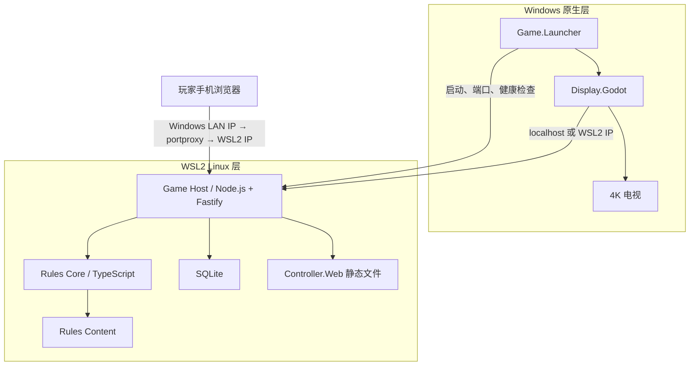

# 实现架构

- 文档版本：0.1
- 状态：建议实现结构，等待技术验证
- 运行剖面：Windows 原生显示 + WSL2 权威主机

## 1. 总体结构



## 2. 进程职责

### 2.1 Windows Launcher

Windows 上运行的 TypeScript/Node.js 小型启动器：

- 保证单实例运行
- 检查 WSL2、目标发行版、当前 WSL IP 和端口转发
- 选择并保留局域网端口
- 通过 `wsl.exe` 启动 Game Host
- 等待健康检查成功
- 启动 Godot 显示端并传入本机连接地址
- 展示防火墙、网络和恢复错误
- 监控两个子系统并执行有序关闭
- WSL2 不可用时选择同一个 Node.js Game Host 的 Windows 构建

Launcher 不保存或判定游戏规则。

### 2.2 Game Host

运行在 WSL2 的 Node.js/Fastify 主机：

- 创建和管理房间、设备及席位
- 提供手机静态页面
- 暴露 HTTP 健康、加入和快照接口
- 承载实时连接
- 调用 Rules Core
- 写入事件、快照和本地档案
- 生成公共、玩家和房主投影
- 提供恢复和录像流

### 2.3 Rules Core

无 I/O 的纯 TypeScript 包：

- 接收规则命令和当前状态
- 验证命令并产生领域事件
- 应用事件得到新状态
- 计算合法动作、连通区域、计分和终局
- 不访问网络、文件、数据库、系统时间、全局随机数或 Godot API

### 2.4 Rules Content

- 规则集 Manifest
- 地块定义和数量
- 拓扑、符号、角色区域和扩展元数据
- 内容 Schema 与校验器
- 官方来源和内容版本哈希

内容文件不是任意脚本。复杂扩展行为由受版本控制的规则模块实现，内容文件只声明数据。

### 2.5 Protocol Contracts

- 命令、事件、快照和错误的 JSON Schema
- TypeScript 类型、运行时校验和协议版本策略
- 面向 Godot 的示例夹具、字段规范和契约测试

Contracts 只描述边界，不包含规则判断。Godot 不复制规则类型，只把通过验证的 JSON 投影转换为显示模型。

### 2.6 Display Godot

Windows 原生 Godot 标准版/GDScript 客户端：

- 订阅公共状态和事件
- 渲染棋盘、地块、角色、计分与连接状态
- 发送房主和 PC 降级输入命令
- 不保存权威随机状态
- 不自行判断最终合法性和得分

### 2.7 Controller Web

React/TypeScript 单页应用：

- 加入、恢复和席位选择
- 当前地块、候选位置、旋转和角色选择
- 私人资源和秘密选择
- 网络状态、重连和错误解释
- 房主的本地管理页面

生产构建嵌入或复制到 Game Host 的静态文件目录。手机端运行时不需要 Node.js；WSL2 Host 本身使用随产品锁定的 Node.js 运行时。

## 3. 建议仓库结构

```text
Carcassonne/
  README.md
  docs/
  package.json
  tsconfig.base.json
  pnpm-workspace.yaml
  pnpm-lock.yaml
  apps/
    game-host/
    controller-web/
    windows-launcher/
    display-godot/
  packages/
    rules-core/
    rules-content/
    protocol-contracts/
    game-projections/
    persistence-sqlite/
    test-fixtures/
  content/
    schemas/
    rulesets/
    tiles/
    scenarios/
  tests/
    rules-unit/
    rules-scenarios/
    rules-properties/
    host-integration/
    protocol-contracts/
    replay-determinism/
    controller-e2e/
  tools/
    content-validator/
    replay-inspector/
    asset-pipeline/
  artifacts/
```

`artifacts/` 不提交大型构建输出；是否提交生成的规则目录和小型测试录像由后续仓库规范确定。

## 4. 目标运行时

建议：

- `rules-core`、`rules-content`、`protocol-contracts`：TypeScript 7、严格模式、ESM
- `game-host`：Node.js 24 LTS、Fastify 5、Linux x64 主部署和 Windows x64 降级部署
- `windows-launcher`：Node.js 24 LTS、TypeScript，随产品携带便携 Windows Node.js 运行时
- `display-godot`：Godot 4.7.1 标准版、GDScript
- `controller-web`：React 19.2、TypeScript、Vite 8
- `persistence-sqlite`：统一接口，技术验证后在 `node:sqlite` 与 `better-sqlite3` 中锁定实现

TypeScript 包可以直接共享编译期类型；Godot 通过 JSON Schema、协议示例和双向契约测试保持兼容，不引用 Node.js 规则代码。

## 5. 启动顺序

```text
Launcher 获取单实例锁
  → 检查 WSL 与配置
  → 选择端口和存档目录
  → 使用锁定的 Node.js 24 运行时启动 WSL2 Game Host
  → 轮询 /health/ready
  → 获取 Host 生成的本地实例令牌
  → 启动 Godot Display
  → Display 建立 localhost WebSocket 连接
  → Host 创建或恢复房间
  → 大屏显示手机加入二维码
```

Game Host 先准备好数据库和规则内容，再返回 Ready。Godot 不应在 Host 尚未可用时显示一个看似可以操作的房间。

## 6. 网络地址

- Host 在 WSL2 内监听一个明确配置的 TCP 端口和 `0.0.0.0`。
- Launcher 通过 `wsl.exe -d <distro> hostname -I` 获取 WSL2 地址，并刷新 `netsh interface portproxy`。
- Godot 优先通过 WSL localhost 转发连接 `127.0.0.1:<publicPort>`，失败时使用 WSL2 IP。
- 手机通过 `http://<windows-lan-ip>:<publicPort>` 打开同源 Controller Web。
- 二维码使用 Windows 可被手机访问的局域网地址，不使用 WSL NAT 私有地址。
- 多网卡时 Launcher 展示候选地址，并允许房主选择。
- mDNS/`.local` 是后续便利功能，二维码和 IP 必须独立可用。
- WSL2 重启或地址改变后，Launcher 必须先更新端口转发，再允许创建房间。

## 7. WSL2 数据位置

建议运行时路径：

```text
/opt/carcassonne/                 只读发布文件
/var/lib/carcassonne/            SQLite、快照和本地档案
/var/log/carcassonne/            主机日志
/run/carcassonne/                运行时锁和临时文件
```

- 活跃 SQLite 不放在 `/mnt/c`。
- 对局结束或有序关闭时，通过数据库 Backup API 产生一致副本。
- 一致副本可以导出到 Windows 用户数据目录，供用户备份。
- Windows 不直接修改 WSL 数据库。

## 8. 开发工作流

### 8.1 WSL2

- Node.js、pnpm、TypeScript、测试和 Game Host 在 WSL2 内运行。
- Linux 密集型依赖目录优先位于 WSL 文件系统。
- Windows 使用 VS Code Remote WSL 或等效方案编辑 Host/Web。

### 8.2 Windows

- Godot 标准版编辑器、GPU 分析、电视输出和 Node.js Launcher 在 Windows 运行。
- Godot 资产源和导入缓存的最佳存放位置由文件监控技术验证决定。

### 8.3 跨文件系统风险

单一仓库同时被 Windows Godot 和 WSL 构建工具高频访问可能产生性能与文件监控问题。技术验证需要比较：

1. 仓库位于 WSL ext4，Godot 通过 `\\wsl.localhost` 访问。
2. 仓库位于 NTFS，WSL 通过 `/mnt/c` 构建。
3. Host/Web 与 Display 使用两个工作树，由 Git 和构建产物连接。

在真实测量前不冻结方案。

## 9. 配置分层

- `config/default.json`：纳入版本控制的非敏感默认配置
- `config/local.json`：可选的本机开发覆盖，不纳入版本控制
- 环境变量：端口、数据目录、日志级别
- Launcher 启动参数：实例 ID、回环地址、恢复目标
- 房间配置：规则集、玩家数、扩展、计时

规则配置必须在开局时冻结并生成哈希，不能被运行时环境变量悄悄改变。

## 10. 日志与诊断

- 每个进程使用同一个启动实例 ID。
- 日志包含进程、房间、对局、命令和事件关联 ID。
- 不记录席位令牌、密码或完整私人负载。
- 规则事件日志与诊断日志分离。
- 大屏提供简洁网络诊断；详细日志通过房主工具导出。
- Host 和 Display 的时钟只用于日志关联，不用于规则顺序。

## 11. 关闭与恢复

正常关闭：

1. Launcher 请求 Host 停止接受新命令。
2. Host 提交当前事务并写入必要快照。
3. Host 生成一致备份和关闭确认。
4. Display 退出。
5. Launcher 停止 WSL Host。

异常退出：

- 已提交数据库的动作视为完成。
- 未提交事务回滚。
- 重启时加载最近快照并重放后续事件。
- 客户端重新连接后以 Host 修订号为准。

## 12. 公网迁移

未来公网部署时：

- `rules-core`、`rules-content`、`protocol-contracts` 保持不变。
- Node.js Game Host 从 WSL2 单实例迁移到 Linux 容器或服务。
- SQLite 更换为适合多实例的服务器数据库，但事件和快照领域模型保持一致。
- Windows Display 与 Controller Web 改连 HTTPS/WSS 公网地址。
- Launcher 不再启动权威 Host，只负责本地大屏和设备协调。

## 13. 架构禁止项

- 不把规则写进 Godot 场景脚本或 React 组件。
- 不让手机直接操作数据库。
- 不用渲染坐标参与规则判定。
- 不以 WebSocket 连接对象或临时连接 ID 作为玩家身份。
- 不把 SQLite 放到共享网络盘。
- 不在数据库提交前广播正式动作。
- 不要求公网服务才能开始本地游戏。
