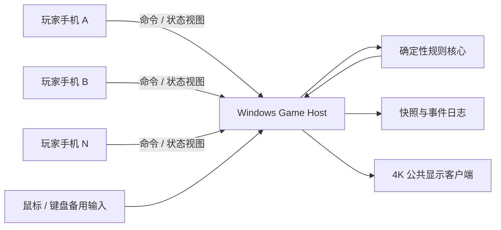
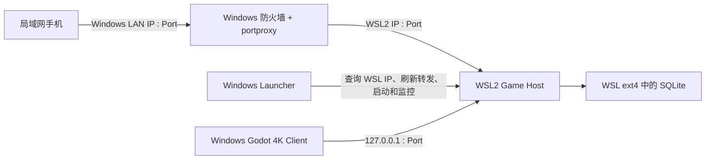
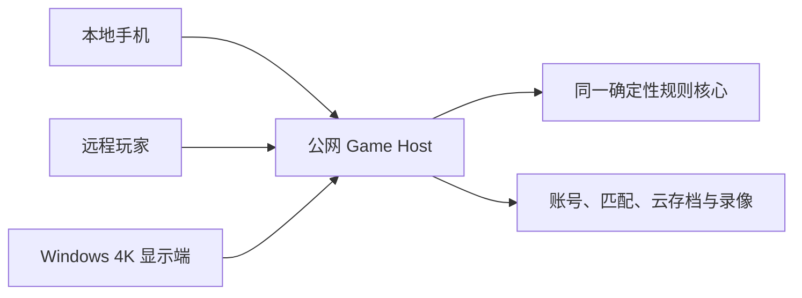

# 局域网架构

- 文档版本：0.1
- 状态：目标架构；WSL2 部署剖面等待目标机验证
- 首阶段：Windows/WSL2 权威主机 + Windows 原生 4K 显示 + 手机网页控制器

本文约束组件职责、数据流和迁移边界，不提前锁定编程语言、3D 引擎或 Web 框架。

## 1. 架构目标

- 没有互联网时可以创建、完成和恢复整场对局。
- Windows 是局域网内唯一权威规则节点。
- 多部手机只接收授权视图并提交操作意图。
- 规则核心不依赖渲染、网络或数据库框架。
- 将来可以把权威主机部署到公网，而不重写规则和控制端协议。

## 2. 首阶段组件



### 2.1 Rules Core

- 地块拓扑、合法动作、回合阶段、计分和胜负
- 无网络、数据库、UI 或 3D 依赖
- 输入为已验证格式的规则命令
- 输出为新状态和语义事件

### 2.2 Game Host

- 房间、席位、设备和权限
- 命令序号、幂等和并发控制
- 调用规则核心并广播事件
- 生成公共视图与玩家私有视图
- 保存事件日志和快照
- 管理局域网发现、二维码和重连

### 2.3 Display Client

- 订阅公共状态
- 渲染 4K 地图、计分、事件和连接状态
- 不计算合法动作或分数
- 固定作为 Windows 原生独立进程运行，通过局域网协议连接 WSL2 Game Host

### 2.4 Controller Web

- 运行在手机浏览器
- 展示当前玩家被授权的数据
- 提交预览、旋转、放置、角色和扩展选择命令
- 保存短期重连凭据，不保存权威对局状态

### 2.5 Persistence

- 追加式事件日志
- 周期性快照
- 本地玩家档案
- 规则版本和扩展清单
- 已完成对局与录像索引

## 3. WSL2 部署剖面

推荐保留 WSL2 默认 NAT。Windows 与 WSL2 使用不同 IP，Windows 负责把局域网端口转发到 WSL2：



部署约束：

- WSL2 使用默认 NAT 和自己的虚拟网卡地址，不要求镜像网络。
- Game Host 使用 Node.js/TypeScript/Fastify，并通过标准 WebSocket 向手机和 Godot 推送事件。
- Game Host 在 WSL2 内监听 `0.0.0.0:<hostPort>`。
- Launcher 每次启动通过 `wsl.exe -d <distro> hostname -I` 获取当前 WSL2 IPv4 地址。
- Launcher 删除该游戏端口的旧转发，再建立 `Windows LAN IP:<publicPort> → WSL2 IP:<hostPort>` 的 `netsh interface portproxy` 规则。
- Godot 可以通过 WSL 的 localhost 转发访问 Host，或使用 Launcher 返回的 WSL2 IP；手机始终使用 Windows 局域网地址。
- Windows 防火墙只允许选定的局域网配置文件和游戏端口，不开放无关端口。
- 二维码直接指向同源的局域网页，Controller Web 和实时端点由同一个 Game Host 提供。
- SQLite 活跃数据库存放在 WSL Linux 文件系统，不直接运行在 `/mnt/c` 或网络共享上。
- Windows Launcher 必须显式启动并监控 WSL 主机；不能假设 systemd 服务会让 WSL 实例永久存活。
- WSL2 不可用时，同一个 Game Host 可以发布为 Windows 原生自包含程序作为兼容后端。

官方依据：

- [Microsoft：WSL 默认 NAT、IP 查询与 portproxy](https://learn.microsoft.com/en-us/windows/wsl/networking)
- [Microsoft：WSL systemd](https://learn.microsoft.com/en-us/windows/wsl/systemd)
- [Microsoft：跨 Windows 与 Linux 文件系统](https://learn.microsoft.com/en-us/windows/wsl/filesystems)

## 4. 权威规则

- 只有 Game Host 可以推进正式状态。
- Display Client 和 Controller Web 不得写入状态存储。
- 客户端的合法位置提示只是预览；提交后由 Rules Core 重新验证。
- 一次命令必须包含房间、对局、席位、回合和客户端序号。
- 重复命令返回原确认结果，不重复执行。
- 过期回合、错误席位和无权限动作必须被拒绝并给出机器可读原因。

## 5. 命令与事件

### 5.1 基础命令

- `CreateRoom`
- `JoinRoom`
- `ApproveDevice`
- `ClaimSeat`
- `SetReady`
- `StartGame`
- `PreviewTilePlacement`
- `CommitTilePlacement`
- `PlaceMeeple`
- `SkipMeeplePlacement`
- `ChooseExpansionAction`
- `PauseGame`
- `ResumeGame`
- `RequestReconnect`
- `RequestSnapshot`

预览命令不写入正式规则日志；确认命令成功后才产生正式事件。

### 5.2 基础事件

- `RoomCreated`
- `PlayerJoined`
- `SeatAssigned`
- `GameStarted`
- `TurnStarted`
- `TileDrawn`
- `TilePlaced`
- `FeatureConnected`
- `MeeplePlaced`
- `FeatureCompleted`
- `PointsAwarded`
- `MeepleReturned`
- `TurnEnded`
- `GameEnded`

扩展通过带版本的事件类型增加能力，不修改旧事件的既有语义。

## 6. 状态视图

权威状态与客户端视图必须分开：

- **完整权威状态**：仅主机持有，包括随机状态和所有私人数据。
- **公共视图**：大屏和所有玩家可见的地图、公共得分和事件。
- **玩家视图**：公共视图加该席位的私人组件和可执行动作。
- **房主视图**：设备状态、席位管理和诊断信息，不自动获得游戏秘密。

不得先把完整状态发送到手机后再依靠前端隐藏字段。

## 7. 房间与连接生命周期

```text
主机启动
  → 创建局域网房间
  → 生成房间 ID、短码和一次性加入令牌
  → 手机扫码请求加入
  → 房主批准并分配席位
  → 全员准备
  → 锁定规则版本与扩展清单
  → 创建随机种子并开始游戏
  → 持续记录事件与快照
  → 完成结算并封存录像
```

## 8. 局域网发现与安全

- 二维码包含局域网地址、房间 ID 和短期加入令牌。
- 短房间码只能用于发现房间，仍需房主批准。
- 服务默认只监听局域网接口，不暴露到公网。
- 所有控制连接在加入后获得独立设备 ID 和席位令牌。
- 主机限制尝试频率、设备数量和消息大小。
- 房间关闭后立即失效所有加入令牌。
- Windows 首次运行时提供明确的防火墙授权说明。
- 局域网内的安全传输方案需要在技术选型阶段验证浏览器兼容性。

## 9. 断线与重连

1. 手机保存不可猜测的设备和席位恢复凭据。
2. 断线后，Game Host 保留席位并启动宽限状态。
3. 手机重连时提交最后确认的事件序号。
4. 若差距较小，主机发送缺失事件；否则发送权限过滤后的完整快照。
5. 客户端应用快照后继续接收实时事件。

当前玩家断线时，由房间规则决定暂停、倒计时、PC 接管或 AI 托管。

## 10. 持久化模型

### 10.1 事件日志

每个正式事件记录：

- 对局 ID
- 单调递增事件序号
- 规则版本和扩展配置哈希
- 触发命令 ID
- 当前回合与席位
- 事件负载
- 前后状态校验值
- 发生时间，仅用于展示而非规则计算

### 10.2 快照

快照至少包含：

- 完整逻辑地图与区域图
- 地块池和确定性随机状态
- 玩家、角色、得分和私人组件
- 当前回合状态机位置
- 已启用规则模块及版本
- 最后事件序号和状态校验值

### 10.3 恢复

加载最近有效快照，再按顺序重放后续事件。恢复后的状态校验值必须与崩溃前最后确认值一致。

## 11. 确定性要求

- 随机行为只能通过规则上下文提供的确定性随机源。
- 浮点位置、动画时间和客户端时钟不得进入规则计算。
- 地图使用整数网格和离散旋转。
- 规则事件包含结果，不让不同客户端重复进行可能不一致的随机抽取。
- 同一日志在开发机、发布版和未来公网主机上必须得到相同终局状态。

## 12. 性能与容量目标

- 官方最多 6 个正式玩家席位。
- 局域网手机控制响应不应产生明显的回合操作延迟。
- 单个慢速手机不能阻塞大屏渲染或其他连接。
- 4K 渲染与规则主机使用独立更新节奏。
- 规则核心即使在关闭渲染时也能高速运行测试和 AI 模拟。

## 13. 公网迁移

未来结构：



公网阶段新增：

- 账号认证和设备会话
- 大厅、邀请、匹配和等级分
- 区域部署和延迟选择
- 云端数据库与对象存储
- 举报、封禁、审计和隐私合规
- 公网加密、速率限制和抗滥用

Windows 在公网模式下不再是权威规则节点，而是公共显示客户端和本地设备协调入口。规则命令、事件和状态视图保持兼容。

## 14. 首阶段架构验收

- 关闭互联网后，六部手机可以通过局域网加入测试房间。
- 非当前席位提交操作会被主机拒绝。
- 重复提交同一确认命令不会重复放置或计分。
- 任意手机断线重连后恢复正确视图。
- Windows 在已确认动作后异常退出，重启可恢复到相同状态。
- 同一事件日志连续重放多次得到相同校验值。
- 大屏客户端关闭或重启不影响权威对局。
- 修改渲染帧率、动画速度或语言不会改变规则结果。
